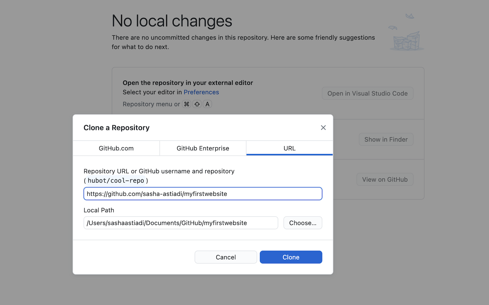
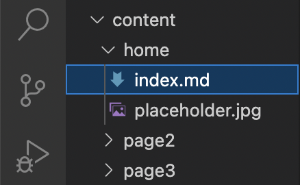
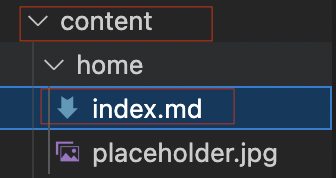
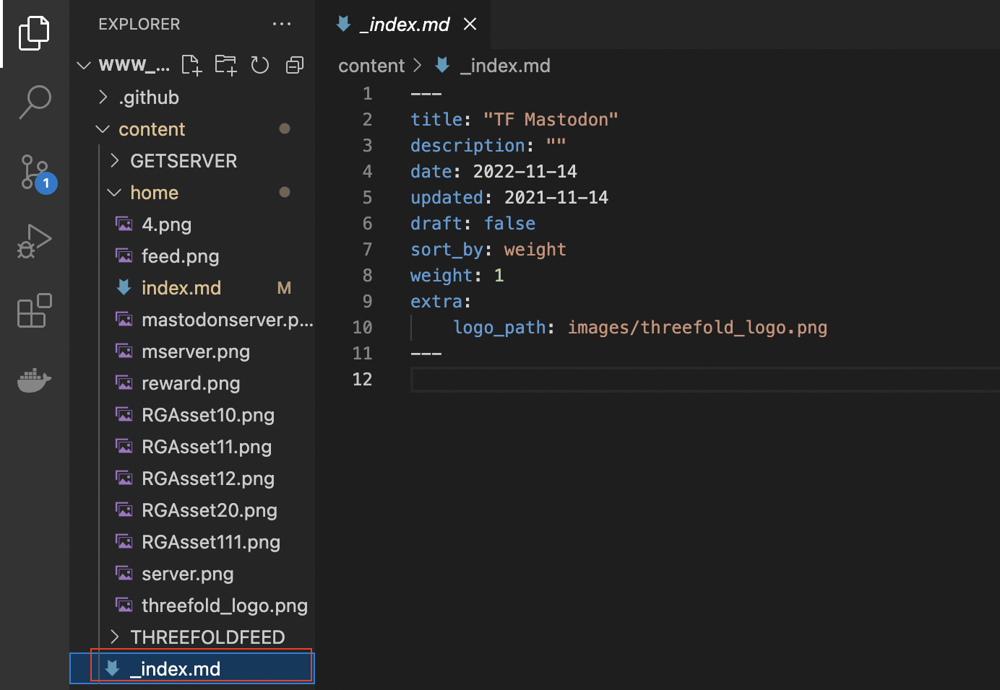
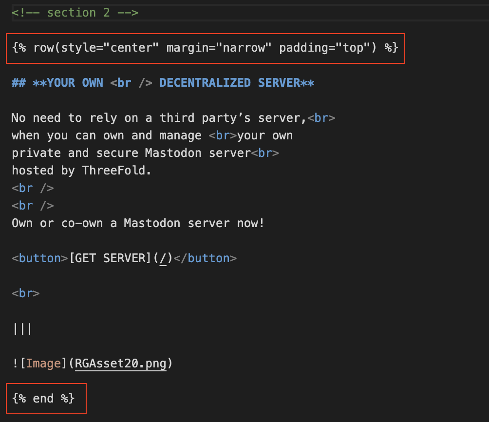
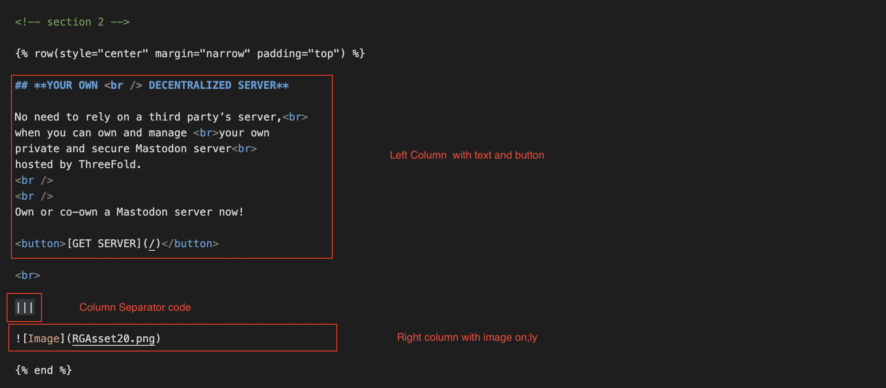
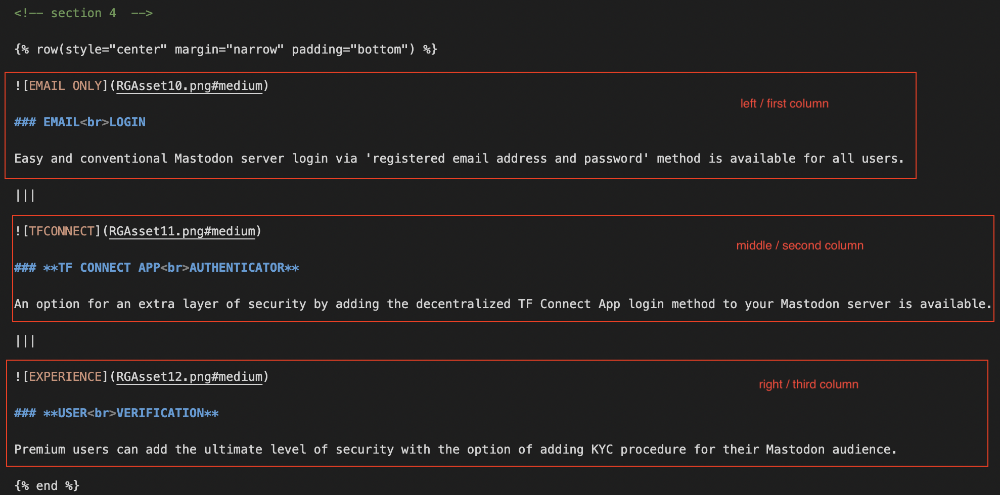
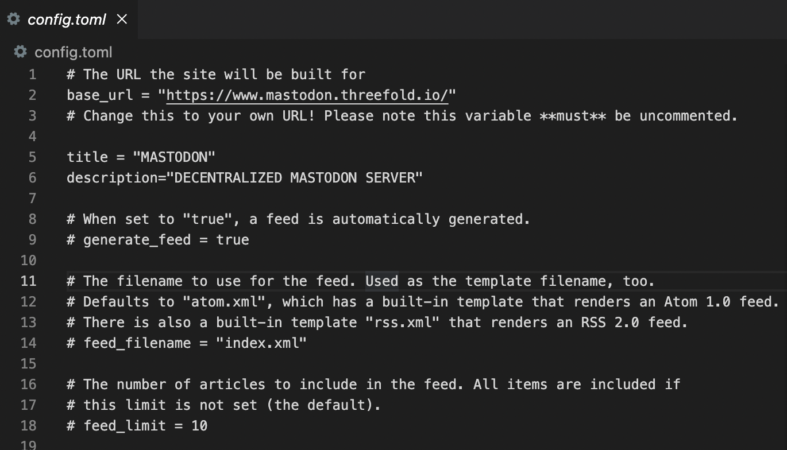
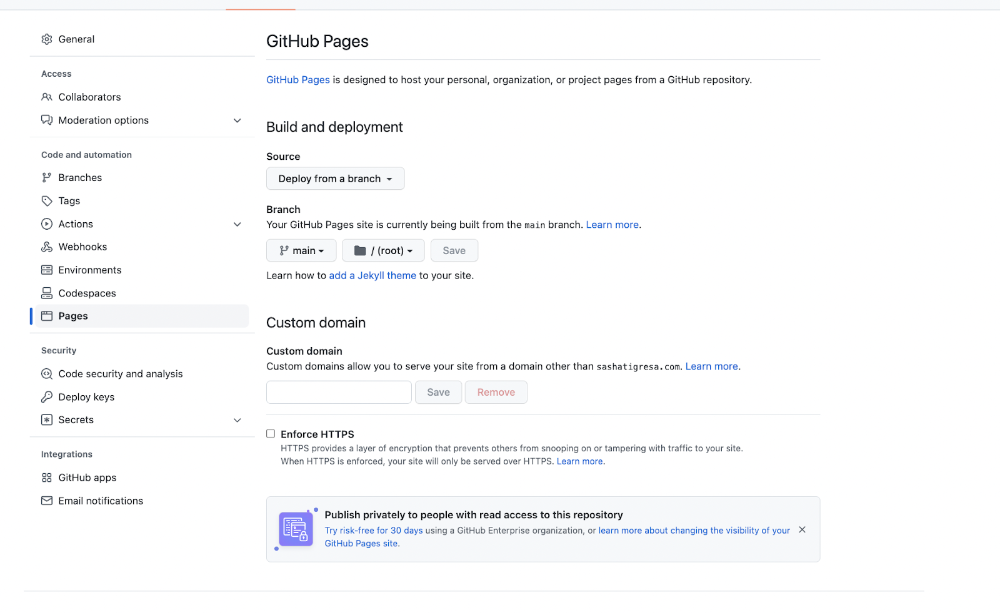

# TF Website Tool (Zola)

## Overview

  

**ThreeFold Website Tool** is a customized open-source Zola-based web deployment framework and static website template repository that is available for anyone to use.

At ThreeFold, we utilized Website Tool to deploy all of our web presences. For example, [**www.threefold.io**](https://threefold.io).

### What is Zola Framework?
[**Zola**](https://www.getzola.org/) is a static site generator (SSG), similar to Hugo, Pelican, and Jekyll (for a comprehensive list of SSGs, please see Jamstack). It is written in Rust and uses the Tera template engine, which is similar to Jinja2, Django templates, Liquid, and Twig. Content is written in CommonMark, a strongly defined, highly compatible specification of Markdown.

While you can also publish a static website using Zola alone, we at ThreeFold have customized the framework and created a static website template that makes it even easier for anyone to build a website by simply cloning template and fill it with their own website content.
<br>

## Prerequisites

- Github Account
- Zola Framework
- VS Code, or any code editor of choice
- Markdown language knowledge
- Basic Command Line (Terminal) Knowledge

In order to deploy and publish a website using ThreeFold Website Tool, you would need to have an account on github (to store your website data in a github repository), as well as to have Zola framework installed on your machine.

### Important Links

> - [How to Sign Up for a Github Account](https://docs.github.com/en/get-started/signing-up-for-github/signing-up-for-a-new-github-account)
> - [Download VS Code](https://code.visualstudio.com/download)
> - [Learn Markdown Language](https://www.markdownguide.org/)
> - [Command Line Cheat Sheet](https://cs.colby.edu/maxwell/courses/tutorials/terminal/)

## Installing Zola onto Your Machine

To install Zola on your machine, simply go to your terminal and run the following command:

**MacOS (brew)**:

```
$ brew install zola
```
Please make sure you have [Brew](https://brew.sh/) installed on your MacOS machine before installing Zola. 

You should see a similar screen as below when successful:


<b>Windows (scoop)</b>:

```
$ scoop install zola
```
Please make sure you have [Scoop](https://scoop.sh/) installed on your Windows machine before installing Zola.

You should see a similar screen as below when successful:


For more details on Zola Installation, and installation guidelines for other operating systems, please read: [**Zola Installation Manual**](https://www.getzola.org/documentation/getting-started/installation/).


### Important Links
> - [How to Install Brew (MacOS)](https://brew.sh/)
> - [How to Install Scoop (Windows)](https://github.com/ScoopInstaller/Scoop#readme)
> - [Zola Installation for other OS](https://www.getzola.org/documentation/getting-started/installation/)
> - [Command Line Cheat Sheet](https://cs.colby.edu/maxwell/courses/tutorials/terminal/)

> Next Step: [Template Guide: How to use the TF Web Template](templateguide)


## Get Started

Now that you have successfully installed Zola on your machine. You are ready to create and build your own website using ThreeFold Website Tool. 

In order to do that you would need to clone [**ThreeFold's Website Template**](https://github.com/threefoldfoundation/www_examplezola) to your own github account, and open it locally on your computer by using VS Code or your code editing program of choice.

### Fork ThreeFold's Website Template to Your Github Account

Our Team has especially created an html/css/markdown based template repository on github, free for anyone to use. To start working on your project, simply fork [this repository](https://github.com/threefoldfoundation/www_examplezola) to your own github account by clicking the 'fork' account on the repository, and rename it with your website's name.


### Clone the Forked Repository Locally
After you forked the template, now you can [clone the repository](https://docs.github.com/en/repositories/creating-and-managing-repositories/cloning-a-repository) to your local computer so we can start working on it. Please remember the directory / folder of where you cloned the repository in your computer to make it easier for you to locate and edit it.




### Open and edit your cloned Zola Template on code editor

Once the template is forked and cloned, open your code editor and start working on your website. I will explain a little more about the content editing process and procedure on the next pages...


### Template Guide

On this page you will find an introduction on [TF Web Template](https://github.com/threefoldfoundation/www_examplezola) and how to navigate the different template component that enable you to edit the template with your own content.

### Navigating the Template

All editable content of your website would be found under **‘content’** folder. 
Each page of your website is a **markdown (.md) file.**

Each page and all the images on the page will be put into its own folder under content/ folder. 

<br>
For example, here, my homepage (index.md) is put into **content/home** folder.


If I want to edit the homepage of my website, I would go to the following:
bb
```
content/home/index.md
```
 and start editing.

 

 ### Top Navbar Made Easy


Every time you make a new page folder, we have designed it in a way that the website would automatically generate a new navbar item using the name of each folder you created.

 based on the navbar picture above, it means that I have created 3 separate content subfolders, each with an index.md file on it called Home, ThreeFoldFeed and GetServer.

### Replace Logo with your Own logo


To replace the logo, **add your own logo image to ‘home’ folder.**

And then go to **_index.md** file and replace the **logo_path**: images/yourlogoimagename.jpg



### Important Links

> - [TF Web Template](https://github.com/threefoldfoundation/www_examplezola)

## Customization

We have designed the template in certain ways that it would accommodate different indentation web page style, such as placeholders, footer, header, left-indentation, right-indentation.

All you need to do is just replace the texts and images using markdown language, and use the indentation style you would like to use for your page. Don’t know how to markdown? Here’s a [**complete markdown syntax guide**](https://www.markdownguide.org/basic-syntax/) for you to begin with.

 Happy experimenting!

### Some Tutorials on Markdown

### Creating A single-column Page Section

Since we only have one column, Every one column section begins only with row indentation syntax (style, margin, padding).


```
<!-- section 1 (header) -->


```

for example:

```
<!-- section 1 (header) -->


```

and ends with 

```

```

For example, the first section of the homepage of [**www.mastodon.io**](www.mastodon.io) in Markdown:




### Adding Image

To add image to your page please use 

```

```

The Result:


### Creating Page Section with Multiple Columns

For more than one column section, we need to configure the row and column syntax.
For example:
Sometimes you would like to have a page where you place your texts and buttons on left column and an image on the right column, like:

What you need to do is add:

```
|||
```
in between your text and images for every column you want to create.

For example, this page consist of two columns (left and right):



The Result:


You can add more than two column like this one, a page section consist of 3 columns.

The code:



The Result:


### Important Links
> - [Learn Markdown Language](https://www.markdownguide.org/)

###  Build and Preview your website locally

After customizing your website, you might want to review and build your website locally before publishing it online. On this page you will find tutorials on how to preview and deploy your website.

To preview your website locally, simply open the terminal via your code editor and type in:

```
./build.sh
```

So that the framework starts building your website.

Then

```
./start.sh
```

So that the framework starts serving your website preview locally. Please make sure you are on located on the right website folder, for example: *$ user/doc/mywebsitename* before typing the command above. 
 
 The preview won't successfuly be built if you run the command in the wrong folder.

When successful, it will give you a link to a local preview of your website. Go ahead and copy paste the url onto your web browser to preview your website locally.


And, Congratulations! You just built your website locally!


### Important Links

> - [Command Line Cheat Sheet](https://cs.colby.edu/maxwell/courses/tutorials/terminal/)

## Publish Your Website (Via Github Pages)

Since we're using github repository to save our website content, the easiest way to publish our website is also through github pages and by using our own domain.

Once all commits have been pushed back to your github repository online, you can start publishing your website.

The first thing you need to do is to go back to your code editor, and find **config.toml** file on your website repo. 
Edit the **base_url** on the **config.toml** file on your repo to your own domain.



Save all your changes and push all your commits to its origin again.

### Publish your Github page

Later on, go to your github repo **settings**, go to **Pages** on the left navigation sidebar. Add your own custom domain to start publishing your website.




And you are done! Your website will be published, and it will take only a minute or so to complete the process. Refresh page, and you will see a link to your newly published website.


## Important Links
> - [Pushing Changes to Github](https://docs.github.com/en/desktop/contributing-and-collaborating-using-github-desktop/making-changes-in-a-branch/pushing-changes-to-github)
> - [Github Pages How-to](https://docs.github.com/en/pages)
> - [Adding Custom Domain to my Github Page](https://docs.github.com/en/pages/configuring-a-custom-domain-for-your-github-pages-site/about-custom-domains-and-github-pages)
