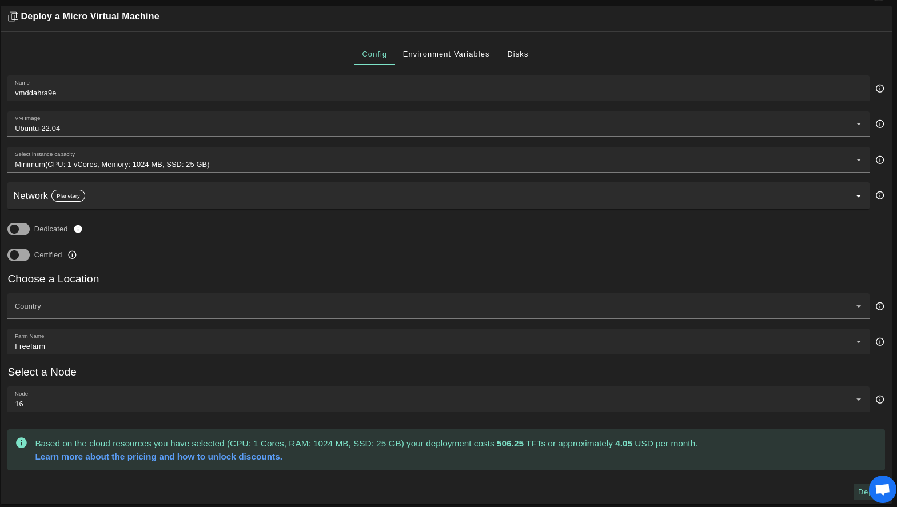

<h1> NixOS MicroVM </h1>

<h2> Table of Contents </h2>

- [Introduction](#introduction)
- [Access the ThreeFold Dashboard](#access-the-threefold-Dashboard)
- [Deploy a NixOS MicroVM](#deploy-a-nixos-microvm)
- [Questions and Feedback](#questions-and-feedback)

***

## Introduction

__NixOS MicroVM__ refers to a minimalistic virtual machine environment based on the NixOS Linux distribution.
The NixOS MicroVM leverages these principles to create a highly customizable and reproducible virtual machine environment. It allows users to define the entire system configuration, including packages, services, and dependencies, in a declarative manner using the Nix language. This ensures that the MicroVM is consistent, easily reproducible, and can be version-controlled.

In this guide, will learn how to make reproducible, declarative and reliable systems by deploying a NixOS MicroVM weblet in ThreeFold Dashboard.

For more information on Nix, you can read the [Nix Reference Manual](https://nixos.org/manual/nix/stable/).


## Access the ThreeFold Dashboard

* Go to the ThreeFold Dashboard website, based on the deployment network you prefer:
  * [Mainnet](https://dashboard.grid.tf)
  * [Testnet](https://dashboard.test.grid.tf)
  * [Devnet](https://dashboard.dev.grid.tf)
  * [QAnet](https://dashboard.qa.grid.tf)

* Make sure you have a [wallet](../wallet_connector.md)
* From the sidebar click on **Solutions**
* Click on **Micro Virtual Machine** to start your NixOS MicroVM Deployment


## Deploy a NixOS MicroVM

We now present the main steps to properly configure your NixOS MicroVM running on the TFGrid.

* In the section `Config`, make sure to select `Nixos` as the `VM Image`. You can choose different parameters (CPU, Memory, etc.) for your deployment depending on your workload needs. 



* In the section `Environment Variables`, you can add the default configurations for Nix. Here's an example:
  * ```
    { pkgs ? import <nixpkgs> { } }:
    let pythonEnv = pkgs.python3.withPackages(ps: [ ]); in pkgs.mkShell { packages = [ pythonEnv ]; }
    ```
    * This will be written to `/root/default.nix`. You can change the Nix shell configuration there.


* In the section `Disks`, you should mount a disk large enough for Nix to store its files used for `nix-store`.
  


* Once your configured the parameters, you can deploy the MicroVM.

If you need more information on how to SSH into your deployment, read [this section](../../getstarted/ssh_guide/ssh_guide.md) of the TF Manual.


## Questions and Feedback

You should now be able to easily deploy a NixOS MicroVM on the ThreeFold Grid.

If you have any question or feedback, you can write a post on the [ThreeFold Forum](http://forum.threefold.io/).