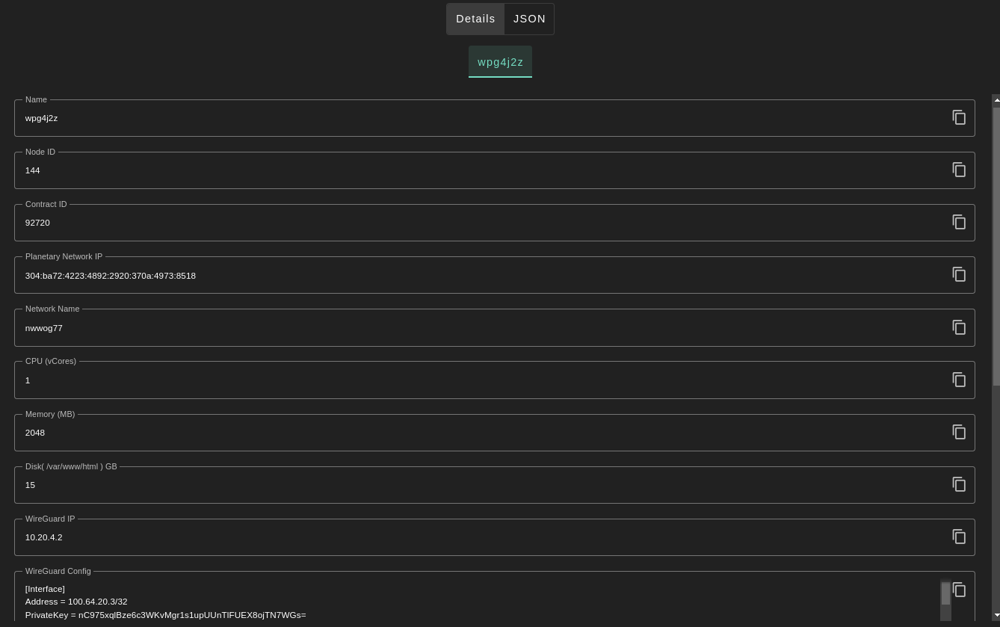
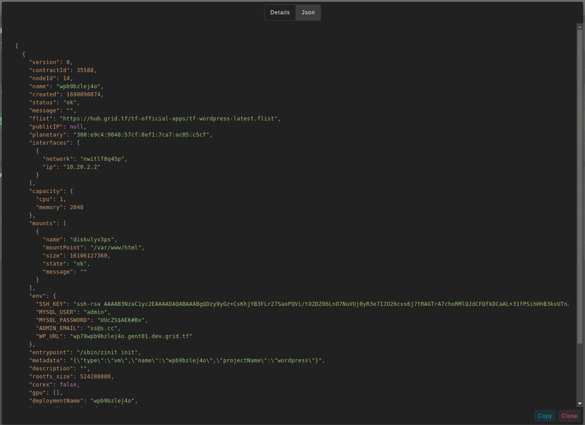
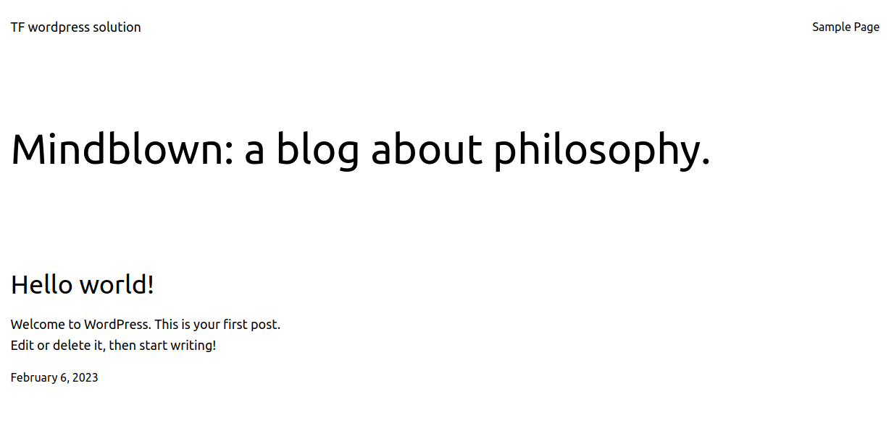
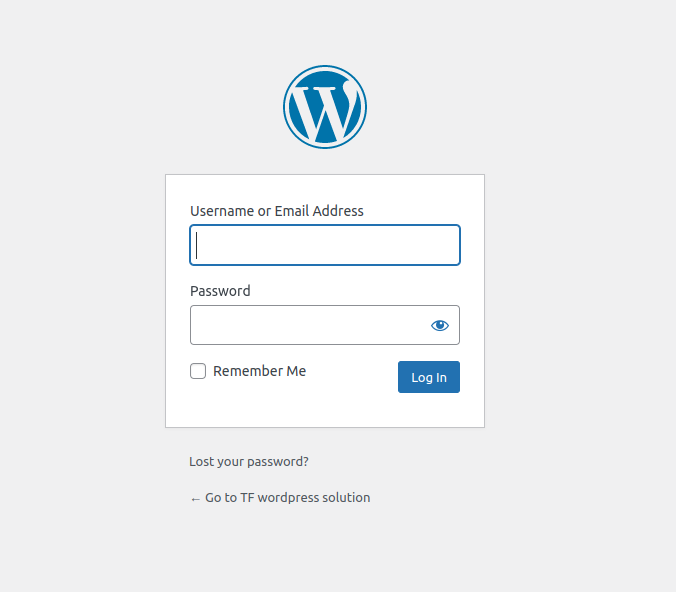

# WordPress

[Wordpress](https://wordpress.org/) is the most popular CMS on the market, powering 65.2% of websites whose CMS we know. That translates to 42.4% of all websites – nearly half of the internet. It is a popular option for those who want to build a website or blog.

- Make sure you have a [wallet](../wallet_connector.md)
- From the sidebar click on **Solutions**
- Click on **Wordpress**

**Process** :

- Enter an instance name.
- Enter admin information.
  - **Username**: will be used as MySQL DB username, and for Wp-admin.
  - **Password**: will be used as MySQL DB password, and for Wp-admin.
  - **Email**: will be used for Wp-admin.
- Select a capacity package:
  - **Small**: { cpu: 1, memory: 2 , diskSize: 15 }
  - **Medium**: { cpu: 2, memory: 4 , diskSize: 50 }
  - **Large**: { cpu: 4, memory: 16 , diskSize: 100 }
  - Or choose a **Custom** plan

- Choose the network
   - `Public IPv4` flag gives the virtual machine a Public IPv4

- `Dedicated` flag to retrieve only dedeicated nodes 
- `Certified` flag to retrieve only certified nodes 
- Choose the location of the node
   - `Country`
   - `Farm Name`
- Choose the node to deploy the Wordpress instance on 
- `Custom Domain` flag lets the user to use a custom domain
- Choose a gateway node to deploy your Funkwhale instance on.

**After Deploying**:

You can see a list of all of your deployed instances

- you can click on `Show details` for more details about the Wordpress deployment.
    
    and for more detailed information switch to `JSON` tap.
    

- Click on ***Visit*** to go to the homepage of your Wordpress instance!
    
- Click on ***Admin Panel*** to go to `wp-admin` of your WordPress instance!

  - Enter the ***Username*** and ***Password*** that you provided in `config` section to login into admin panel.
    > Forget the credentials? You can find them with `Show details` button.

    
