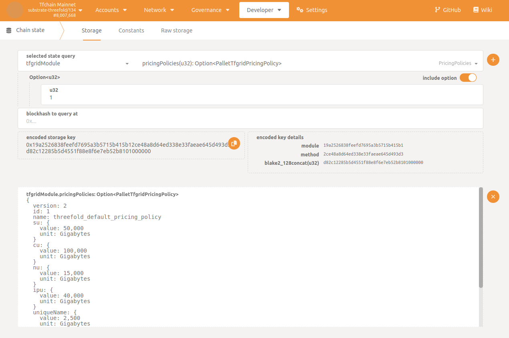
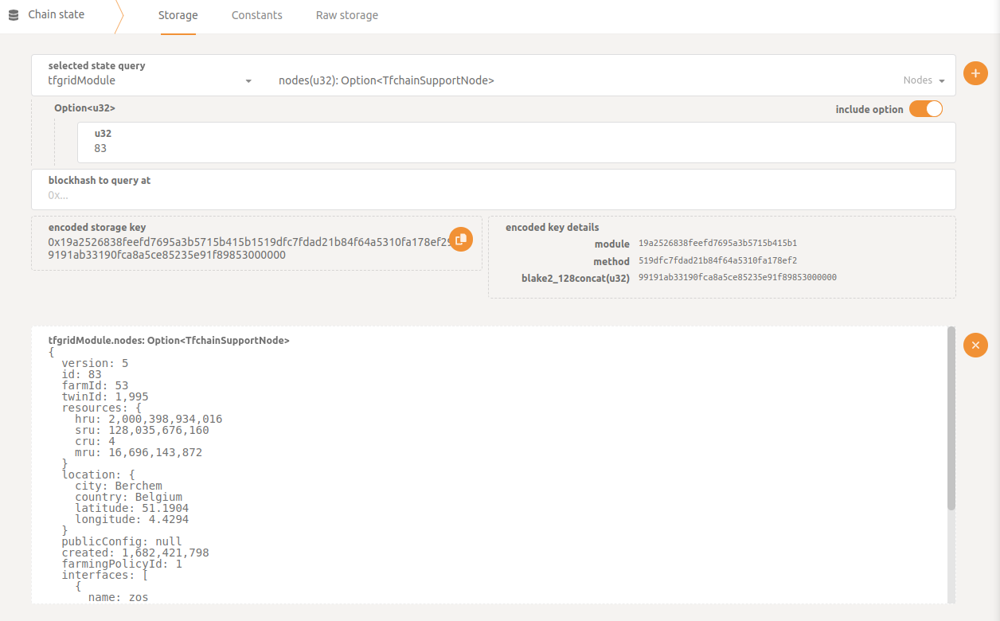
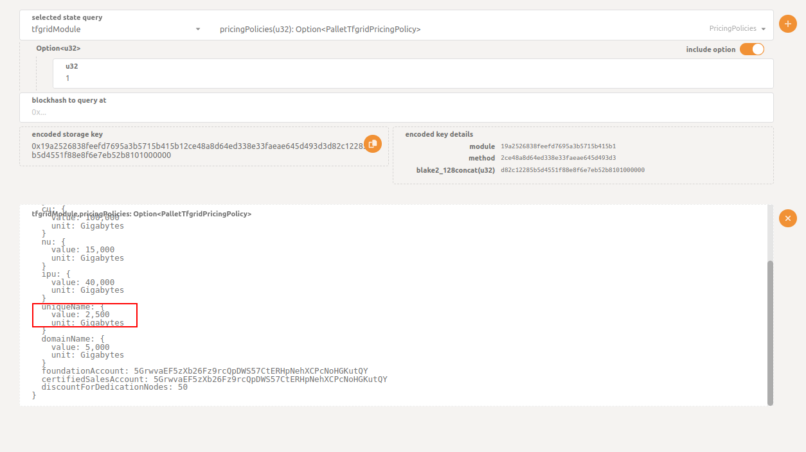
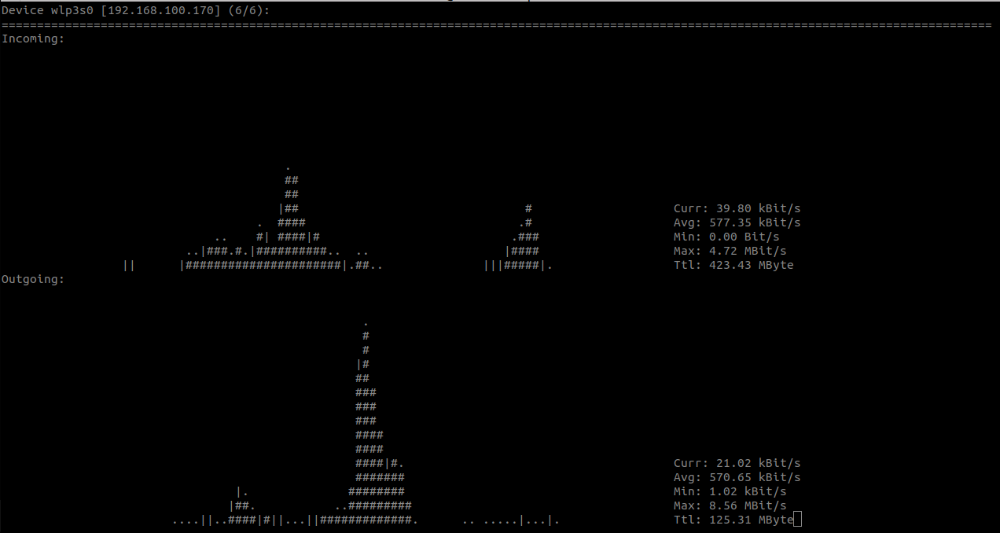
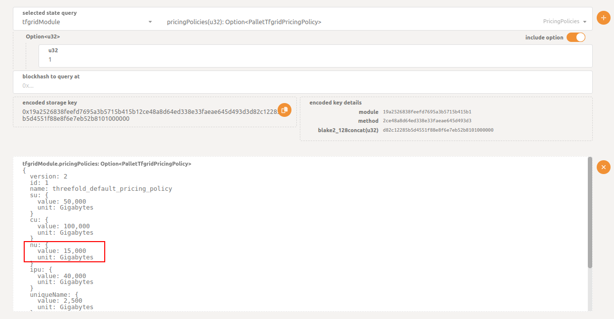

<h1>Grid Billing</h2>

<h2>Table of Contents</h2>

- [Introduction](#introduction)
- [Resources to Update](#resources-to-update)
  - [Current TFT Price](#current-tft-price)
  - [Current Cloud Units Values](#current-cloud-units-values)
- [Node Contract](#node-contract)
  - [Calculating the CU](#calculating-the-cu)
  - [Calculating the SU](#calculating-the-su)
  - [Calculating the Billing Rate for the Contract](#calculating-the-billing-rate-for-the-contract)
  - [Applying the Discounts](#applying-the-discounts)
- [Rent Contract](#rent-contract)
  - [Getting the Resources](#getting-the-resources)
  - [Calculating the CU](#calculating-the-cu-1)
  - [Calculating the SU](#calculating-the-su-1)
  - [Calculating the Billing Rate for the Contract](#calculating-the-billing-rate-for-the-contract-1)
  - [Applying the Dedicated Node Discount](#applying-the-dedicated-node-discount)
  - [Applying the Staking Discount](#applying-the-staking-discount)
- [Name Contract](#name-contract)
  - [Applying the Staking Discount](#applying-the-staking-discount-1)
- [Public IP](#public-ip)
  - [Applying the Staking Discount](#applying-the-staking-discount-2)
- [Network Usage](#network-usage)
  - [Data Usage](#data-usage)
  - [NU Value](#nu-value)
  - [Applying the Staking Discount](#applying-the-staking-discount-3)
- [Billing History](#billing-history)

***

## Introduction

In this section, we explain how the billing works on the TFGrid by showing different examples such as node, rent and name contracts as well as public IP and network usage. 

<!--

(We can add this when 3.13 is released)

This documentation can be used in parallel with the [TFGrid Pricing Calculator](https://dashboard.grid.tf/#/deploy/pricing-calculator/) available on the Dashboard.

-->

## Resources to Update

Some of the used resources should be updated whenever you try to do these calculations, these resources are the TFT price and the cloud units (SU and CU).

### Current TFT Price

TFT price can be retrieved directly through [Stellar](https://stellar.expert/explorer/public/asset/TFT-GBOVQKJYHXRR3DX6NOX2RRYFRCUMSADGDESTDNBDS6CDVLGVESRTAC47-1?asset[]=TFT-GBOVQKJYHXRR3DX6NOX2RRYFRCUMSADGDESTDNBDS6CDVLGVESRTAC47-1&filter=markets&market=USDC-GA5ZSEJYB37JRC5AVCIA5MOP4RHTM335X2KGX3IHOJAPP5RE34K4KZVN-1) or from the [Dashboard](https://dashboard.grid.tf/), through the price available in the header.


### Current Cloud Units Values

The current cloud units values can be retrieved directly from TChain with the [Polkadot UI](https://polkadot.js.org/apps/?rpc=wss%3A%2F%2Ftfchain.grid.tf#/chainstate) and the current chain state.

- On the page `Chain State`, select `tfgridModule` as the `selected state query`
- Select `pricingPolicies(u32): Option<PalletTfgridPricingPolicy>`
- Enter the value of the default pricing policy, which is `1`, or enter the value of any other policy if you need to use a custom one
- Press `Enter`



> Note: Values on chain are expressed as "units USD per hour", where "1 unit USD" == 10.000.000 (or 1e7)

## Node Contract

For this example, we will assume that the resources for this deployment are the following:

```
CRU: 2 
MRU: 2
SRU: 15
HRU: 0
```

### Calculating the CU

Let's calculate the CU of this deployment.

For our example, the CU value is `10 mUSD/h`. Make sure that this value is updated according to the current values.

```
CU = min( max(MRU/4, CRU/2), max(MRU/8, CRU), max(MRU/2, CRU/4) )
   = min( max(2/4, 2/2), max(2/8, 2), max(2/2, 2/4) )
   = min( max(0.5, 1), max(0.25, 2), max(1, 0.5) )
   = min( 1, 2, 1 )
   = 1
CU cost/hour = CU * CU pricing
             = 1 * 10 mUSD/h
             = 10 mUSD/h         
```


### Calculating the SU

Let's calculate the SU of this deployment.

The current SU value is `5 mUSD/h`. Make sure that this value is updated according to the current values.

```
SU = HRU/1200 + SRU/200
   = 0/1200 + 15/200
   = 0 + 0.075
   = 0.075
SU cost/hour = SU * SU pricing
             = 0.075 * 5 mUSD/h
             = 0.375 mUSD/h
```


### Calculating the Billing Rate for the Contract

Let's calculate the billing rate by combining the CU and SU from above.

For this example, the current TFT value is `0.011 USD`. Make sure that this value is updated according to the current TFT value.

```
Contract cost/hour = CU cost/hour + SU cost/hour
                   = 10 mUSD/h + 0.375 mUSD/h
                   = 10.375 mUSD/h
                   = 0.010375 USD/h
                   = 0.010375 * 24 * 30
                   = 7.47 USD/month
                   = 679.090909 TFT/month
                   = 0.943182 TFT/hour
```

### Applying the Discounts

Before assuming that the price above is the final price, check first if your twin is eligible for any of the available staking discount levels. To understand more about discount levels, please read [this section](../wiki/cloudunits/pricing/staking_discount_levels.md).

For this example, we assume that this twin has 18 months worth of TFTs staked, so the user will be eligible for a Gold discount level (60% discount).

The 60% discount is thus equivalent to paying only 40% of the total price, as shown below:

```
Cost with 60% discount = 0.943182 * 0.4
                       = 0.377273 TFT/hour
```


## Rent Contract


### Getting the Resources

You can get the resources of a node using different methods. You can use Grid Proxy, GraphQL and the Polkadot UI.

- Using Grid Proxy
  - Grid Proxy API
    - Go to the section [nodes endpoint](https://gridproxy.grid.tf/swagger/index.html#/GridProxy/get_nodes__node_id_)
    - Click on `Try it out`
    - Write the node ID
    - Click on `Execute`
  - Grid Proxy URL
    - You can use the following URL and replace <node_id> by the node ID: 
        ```
        https://gridproxy.grid.tf/nodes/<node_id>
        ```

- Using GraphQL

   Navigate to [ThreeFold's GraphQL](https://graphql.grid.tf/graphql), then use the following query and replace the node id with the desired node id.
   
   ```
   query MyQuery {
  nodes(where: {nodeID_eq: 83}) {
    id
    farmingPolicyId
    resourcesTotal {
      cru
      mru
      sru
      hru
      }
    }
  }

   ```

- TFChain and Polkadot UI
  - On the page Chain State of the [polakdot UI](https://polkadot.js.org/apps/?rpc=wss%3A%2F%2Ftfchain.grid.tf#/chainstate), select `tfgridModule` as the `selected state query`
  - Select `nodes(u32): Option<TfchainSupportNode>`
  - Enter the node ID
  - Press `Enter`

   


For our example, these are the resources for node `83` that will be used for the calculations.

```
CRU = 4
SRU = 119.24
HRU = 1863
MRU = 15.55
```

### Calculating the CU

Let's calculate the CU of this deployment.

For our example, the CU value is `10 mUSD/h`. Make sure that this value is updated according to the current values.

```
CU = min( max(MRU/4, CRU/2), max(MRU/8, CRU), max(MRU/2, CRU/4) )
   = min( max(15.55/4, 4/2), max(15.55/8, 4), max(15.55/2, 4/4) )
   = min( max(3.8875, 2), max(1.94375, 4), max(7.775, 1) )
   = min( 3.8875, 4, 7.775 )
   = 3.8875
CU cost/hour = CU * CU pricing
             = 3.8875 * 10 mUSD/h
             = 38.875 mUSD/h
```


### Calculating the SU

For our example, the SU value is `5 mUSD/h`. Make sure that this value is updated according to the current values.

```
SU = HRU/1200 + SRU/200
   = 1863/1200 + 119.24/200
   = 1.5525 + 0.5962
   = 2.1487
SU cost/hour = SU * SU pricing
             = 2.1487 * 5 mUSD/h
             = 10.7435 mUSD/h
```

### Calculating the Billing Rate for the Contract

For our example, the current TFT value is `0.011 USD`.  Make sure that this value is updated according to the current values.

```
Contract cost/hour = CU cost/hour + SU cost/hour
                   = 38.875  mUSD/h + 10.7435 mUSD/h
                   = 49.6185 mUSD/h
                   = 0.0496185 USD/h
                   = (0.0496185 * 24 * 30) 
                   = 35.72532 USD/month
                   = 3247.75636 TFT/month
```

### Applying the Dedicated Node Discount

There's a default `50%` discount for renting a node, this discount is not related to the staking discount. For more information on dedicated node discounts, please [read this section](../../../documentation/dashboard/deploy/dedicated_machines.md).

```
Cost with 50% discount = 35.72532 * 0.5
                       = 17.86266 TFT/month
```

### Applying the Staking Discount

Before assuming that the price above is the final price, check first if your twin is eligible for any of the available staking discount levels. To understand more about discount levels, please read [this section](../pricing/staking_discount_levels.md).

For this example, let's assume that this twin has 18 months worth of TFTs staked, so the user will be eligible for a Gold discount level (60% discount).


```
Cost with 60% discount = 17.86266 * 0.4
                       = 7.145064 TFT/month
```

## Name Contract

Let's calculate the cost of a name contract.

For our example, we use the following value from the Pricing Policy.



This value can then be converted to USD.

```
uniqueName in USD = 2500 / 10000000
                  = 0.00025 USD/hour

```
Since the current TFT conversion rate is `1 USD = 100 TFT`, we have the following:

```
uniqueName in TFT = 0.00025 * 100
                  = 0.025 TFT/hour
```

### Applying the Staking Discount

Before assuming that the price above is the final price, check first if your twin is eligible for any of the available staking discount levels. To understand more about discount levels, please read [this section](../wiki/cloudunits/pricing/staking_discount_levels.md).

For this example, let's assume that this twin has 18 months worth of TFTs staked, so the user will be eligible for a Gold discount level (60% discount).

```
Cost with 60% discount = 0.025 * 0.4
                       = 0.01 TFT/hour
                        
```

## Public IP

Let's calculate the cost of public IPs. 

For our example, we use the following value from the Pricing Policy.


This value can then be converted to USD.

```
Public IP in USD = 40000 / 10000000
                  = 0.004 USD/hour

```

Since the current TFT conversion rate is `1 USD = 100 TFT`, we have the following:

```
Public IP in TFT = 0.004 * 100
                  = 0.4 TFT/hour
```

### Applying the Staking Discount

Before assuming that the price above is the final price, check first if your twin is eligible for any of the available staking discount levels. To understand more about discount levels, please read [this section](../wiki/cloudunits/pricing/staking_discount_levels.md).

For this example, let's assume that this twin has 18 months worth of TFTs staked, so the user will be eligible for a Gold discount level (60% discount).

```
Cost with 60% discount = 0.4 * 0.4
                       = 0.16 TFT/hour
                        
```

> Note: This value gets added to the billing rate of your deployment.


## Network Usage

Network Usage is calculated for deployments with public IPs. It's reported every hour and its cost can be calculated approximately as follows, where the data usage is the value of data sent and received:

```
network usage = data usage * NU value
```

### Data Usage

To start, let's calculate the data usage. This can be tracked with a network tool like [nload](https://github.com/rolandriegel/nload),  where the total amount of data sent and received can be displayed.




### NU Value

Let's find the NU value of this deployment.

For our example, we use the following value from the Pricing Policy.



This value can then be converted to USD.

```
NU price in USD = 15000 / 10000000
                  = 0.0015 USD/hour

```
Since in our example the current TFT conversion rate is `1 USD = 100 TFT`, we have the following:

```
NU price in TFT = 0.0015 * 100
                  = 0.15 TFT/hour
```

### Applying the Staking Discount

Before assuming that the price above is the final price, check first if your twin is eligible for any of the available staking discount levels. To understand more about discount levels, please read [this section](../wiki/cloudunits/pricing/staking_discount_levels.md).

For this example, let's assume that this twin has 18 months worth of TFTs staked, so the user will be eligible for a Gold discount level (60% discount).

```
Cost with 60% discount = 0.15 * 0.4
                       = 0.06 TFT/hour
                        
```

As an example, let's assume that we used a total of 10GB in the last hour, so the next hour the billing rate should be updated to:

```
Total network usage = 10GB * 0.06 TFT/hour
                    = 0.6 TFT/hour
```

The billing rate in the next hour should be the following:

```
hourly billing rate = actual cost of the deployment + total network usage
```


> Note: The calculated value will always be an approximation since it's not possible to manually calculate the exact value of the data used.


## Billing History

Since the billing rate gets updated hourly, you can check the billing history from [GraphQL](https://graphql.grid.tf/graphql) using the following query. Make sure to enter the proper contract ID.

```
query MyQuery {
  contractBillReports(where: {contractID_eq: ""}) {
    contractID
    amountBilled
    discountReceived
    timestamp
  }
}

```