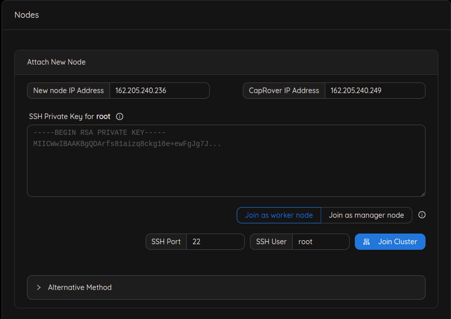
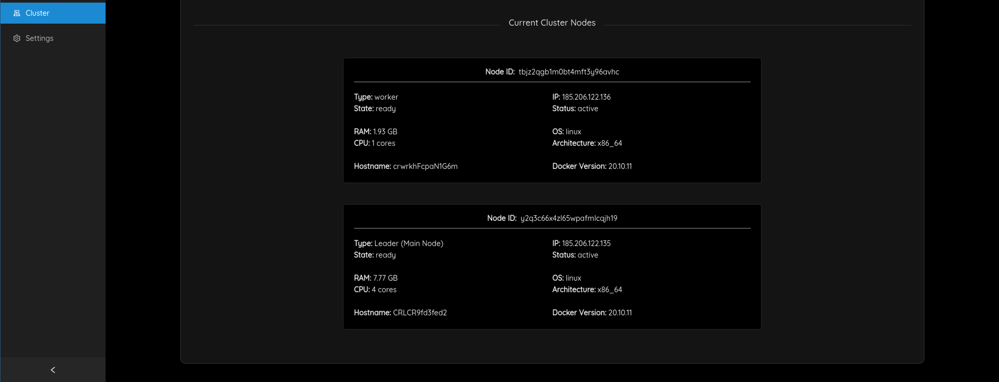

<h1> Add a New Worker Node </h1>

<h2> Table of Contents </h2>

- [Step 1: Add a Default Docker Registry](#step-1-add-a-default-docker-registry)
- [Step 2: Attach a New Node to the Cluster](#step-2-attach-a-new-node-to-the-cluster)

***

## Step 1: Add a Default Docker Registry

You'll have to add a default docker registry so other CapRover nodes in the cluster can download images from, and it can be self-hosted (managed by CapRover itself), to add it, go to `Cluster` -> `Docker Registry Configuration`.

- Click `Add Self-Hosted Registry` button, then click `Enable Self-Hosted Registry`

You can check [official documentation](https://caprover.com/docs/app-scaling-and-cluster.html#setup-docker-registry) to know more about Docker registry options.

***

## Step 2: Attach a New Node to the Cluster

- Add the public IPv4 address that has been returned from the worker deployment in the `New node IP Address` field.
- Add your `SSH private key` (you can use this command `cat ~/.ssh/id_rsa` to get your private key).
- Click `Join cluster` button.

You should see the new added node **Current Cluster Nodes**

If you faced any problem you can use the `Alternative method`.

Also you can check for Troubleshooting instruction on [Caprover Troubleshooting](https://caprover.com/docs/troubleshooting.html#second)