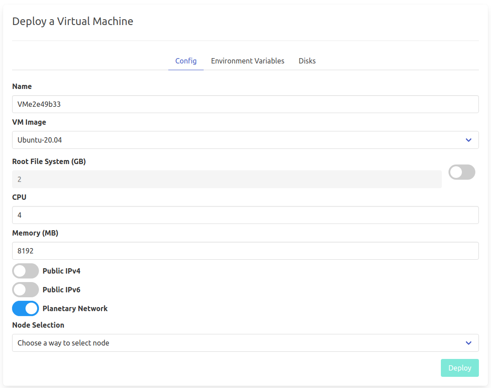
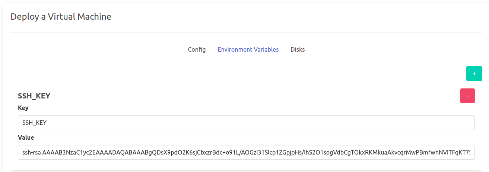
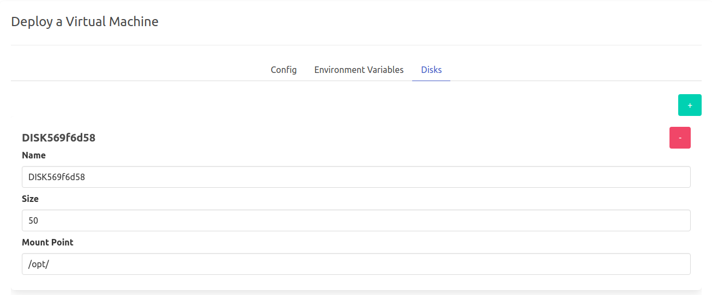
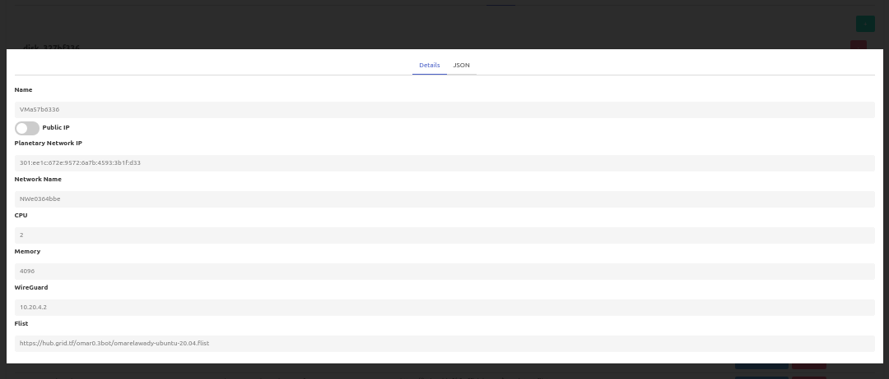
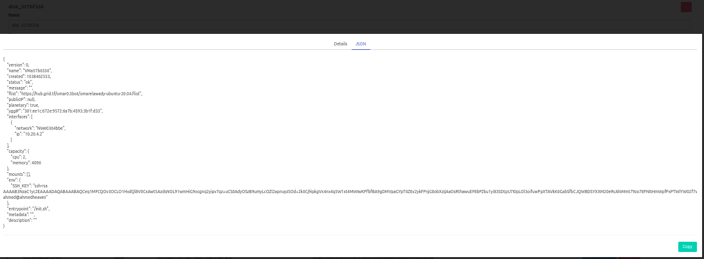

<h1>Virtual Machine</h1>

<h2>Table of Contents</h2>

- [Introduction](#introduction)
- [Prerequisites](#prerequisites)
- [Deployment](#deployment)

***

## Introduction

We show how to deploy a new virtual machine on the ThreeFold Grid.

## Prerequisites

- Connect your TFChain Wallet to the Playground 
- Click on the **Virtual Machine** tab

## Deployment

- Fill in the instance name: it's used to reference the VM in the future.
- Choose the image from the drop down (e.g Alpine, Ubuntu) or you can click on `Other` and manually specify the flist URL and the entrypoint.
- `Public IPv4` flag gives the virtual machine a Public IPv4
- `Public IPv6` flag gives the virtual machine a Public IPv6
- `Planetary Network` to connect the Virtual Machine to Planetary network
- Choose the node to deploy on which can be
   - Manual: where you specify the node id yourself
   - Automatic: Suggests nodes list based on search criteria e.g `country`, `farm`, capacity..
  

Clicking on enviornment allows you to define environment variables to pass to the virtual machine. 
> Note the Public SSH key in the profile is automatically used as variable `SSH_KEY` passed to all Virtual Machines 

You can attach one or more disks to the Virtual Machine by clicking on the Disks tab and the plus `+` sign and specify the following parameters
   - Disk name 
   - Disk size
   - Mount point

in the bottom of the page you can see a list of all of the virual machines you deployed. you can click on `Show details` for more details

You can also go to JSON tab for full details

__Difference Between Full Virtual Machine and Micro Virtual Machine__ : 
   - In a Micro Virtual Machine:
      - It's meant to host microservice. and the user should enter the entrypoint.
      - The user has no control over ther kernel used to run the machine.
      - The network setup will be created for the user. And the vm's init process can assume that it will be fully set up (according to the config the user provided) by the time it is started. 
      - Mountpoints will also be setup for the user. The environment variables passed will be available inside the the vm.
   - In a Full Virtual Machine:   
      - The users run their own operating system, but the image must be
         - EFI bootable
         - Cloud-init enabled.
      - It contains a default disk attached, as the boot image will be copied to this disk.
      - The default disk is mounted on / so if you want to attach any additional disks, you have to choose a different mounting point.
      - A /image.raw file is used as "boot disk". This /image.raw is copied to the first attached volume of the vm. Cloud-init will take care of resizing the filesystem on the image to take the full disk size allocated in the deployment.